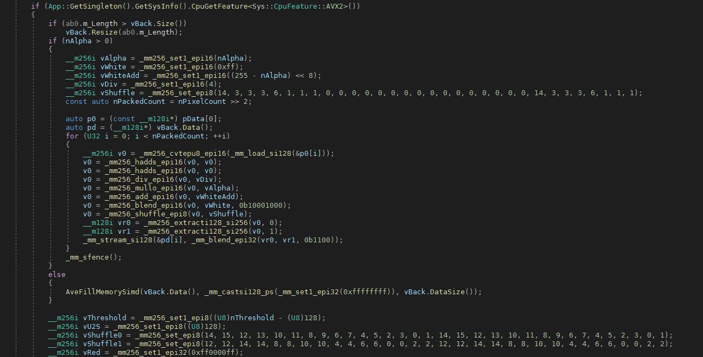
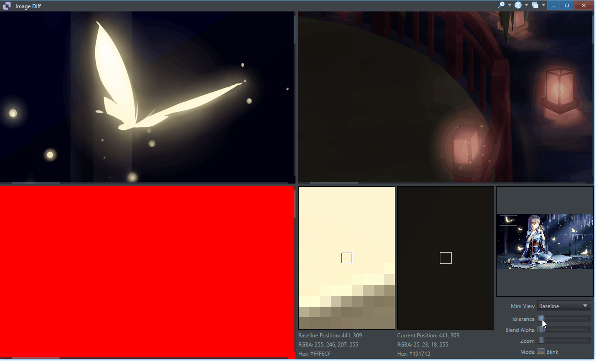
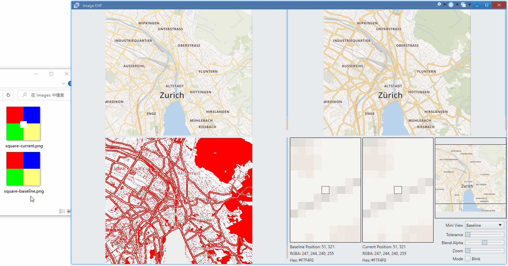
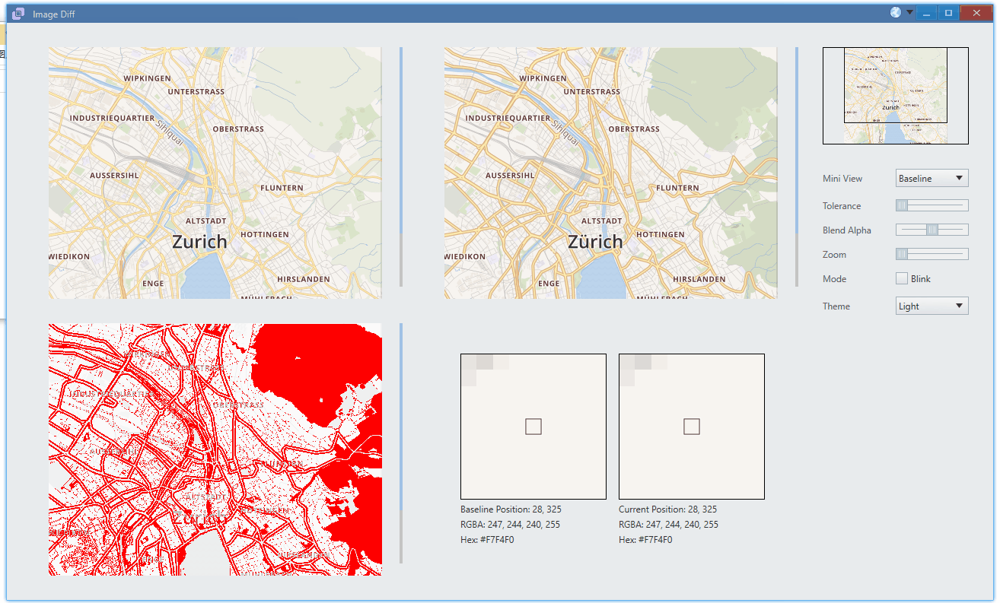
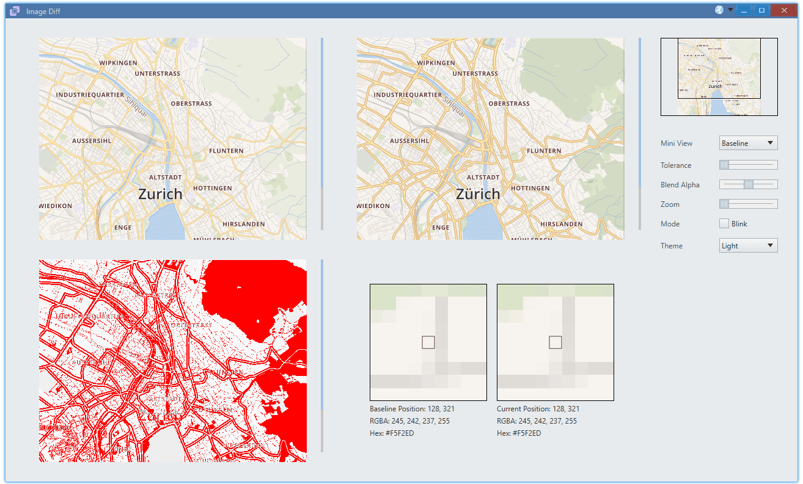

<p align="center">
    
</p>

<h1 align="center">Image Diff</h1>

English | [简体中文](./README_zh-cn.md)

# Introduction

This is the tutorial project of [Avernakis UI](https://qber-soft.github.io/Ave-Nodejs-Docs/).

Tiny, but production ready.


# Install

Use npm as nam! (Node App Manager)

```bash
> npm i -g ave-image-diff
```

Run:

```bash
> image-diff
```

# Features & Usage

-   high performance C++ implemented pixel diff & 4k image support



Instead of using js implemented [pixelmatch](https://github.com/mapbox/pixelmatch), we use our C++ implementation, which is 10x faster. (`300ms ~ 500ms -> 20ms ~ 30ms`)

In this way, even tolerance can be adjusted in realtime for 4k image, which is impossible for [pixelmatch](https://github.com/mapbox/pixelmatch).



-   blink, blink, blink!


-   open images: drag to drop





> press `space` to lock and copy color

-   custom theme: geek style!



-   basic controls: checkbox, trackbar, combo box ...
-   custom component: reuse mini view, pixel view from [color picker](https://github.com/rerender2021/ave-color-picker)

## Dev

```bash
> npm install
> npm run dev
```

## Package

```bash
> npm run release
```

## License

[MIT](./LICENSE)
