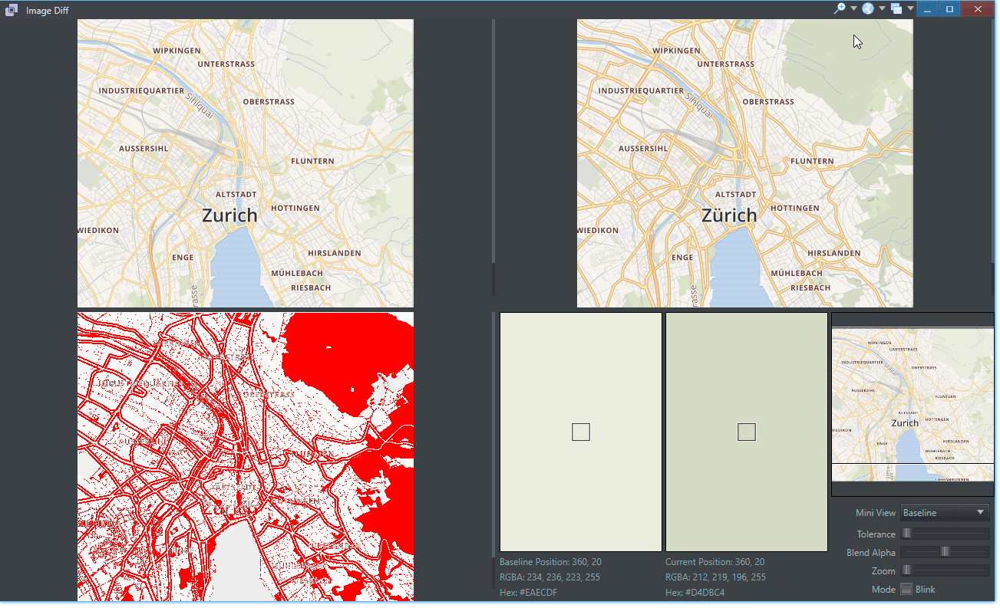

<p align="center">
    
</p>

<h1 align="center">图像对比工具</h1>

简体中文 | [English](./README.md)

# 简介

这既是 [Avernakis UI](https://qber-soft.github.io/Ave-Nodejs-Docs/) 的教学演示项目，也是实用小工具：


麻雀虽小，五脏俱全。它包含以下功能：

-   C++ 实现的高性能像素对比（流畅支持 4k 图像的对比哦）


我们没有使用 js 实现的 [pixelmatch](https://github.com/mapbox/pixelmatch) ，而是将像素对比实现在 C++，速度快了 10 倍多， (`300ms ~ 500ms -> 20ms ~ 30ms`)。

所以即使是对比 4k 图像，`允许误差`也可以实时调整，用 [pixelmatch](https://github.com/mapbox/pixelmatch) 就不行。


-   提供闪烁模式更方便地看图像差别


-   打开的图像的方式是拖拽释放，可以一次拖 2 张图片，也可以一张一张拖：


> 按空格键锁定，然后可以去复制当前像素颜色信息

-   自定义主题：极客风


-   hi-dpi 支持：自动适应代码或系统设置的缩放比例




-   基本控件：多选框、轨道条、下拉列表...
-   自定义控件：复用 [color picker](https://github.com/rerender2021/ave-color-picker) 中的迷你视图、像素视图

# 安装

把 npm 当作应用管理器吧！

> Use npm as nam! (Node App Manager)

像安装 CLI 一样安装:

```bash
> npm i -g ave-image-diff
```

但是这次将启动桌面应用程序：

```bash
> image-diff
```

## 开发

```bash
> npm install
> npm run dev
```

## 打包

```bash
> npm run release
```

## 开源协议

[MIT](./LICENSE)
